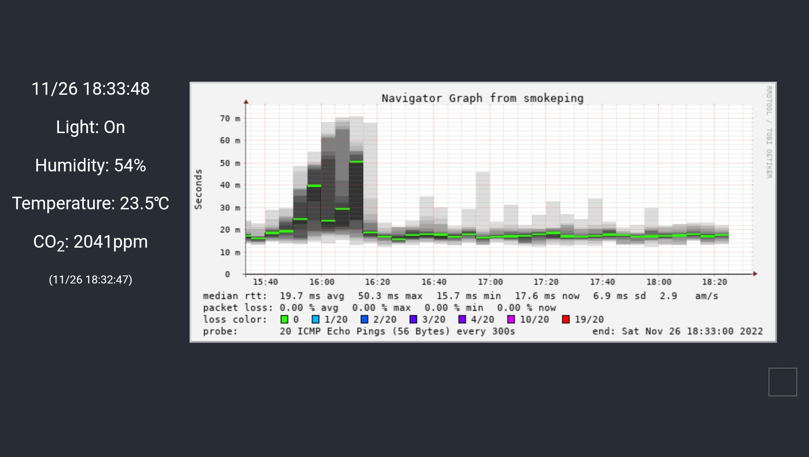

# Harmonica Web

自宅センサーモニター用Webフロントエンドアプリ（React製）。

Next.js実装に移行したため、メンテナンスを終了します。

- <https://github.com/aoirint/harmonica-web-next>



## Development environment

- Node 18
- npm 8
- (Recommended) nvm: <https://github.com/nvm-sh/nvm>

## Run the development server

```shell
nvm use

npm ci

cp template.env .env
```

Modify `.env`.

```shell
npm run codegen

npm start
```


## Deployment

```shell
nvm use

npm ci

npm run build

rsync -av --delete build/ server:target-dir/
```
