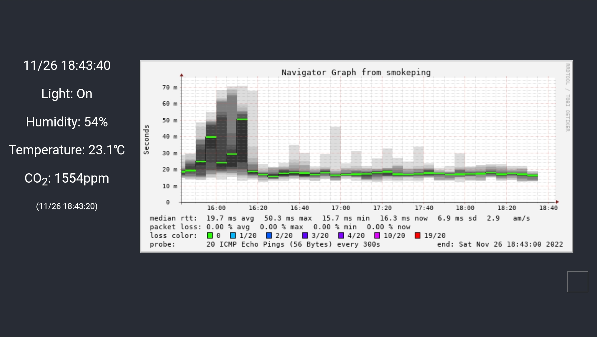

# Harmonica Web

自宅センサーモニター用Webフロントエンドアプリ（React製）。

Next.js実装に移行したため、メンテナンスを終了します。

- <https://github.com/aoirint/harmonica-web-next>



## Runtime

- Node 18
- npm 8

## Develop

```shell
npm ci

cp template.env .env
```

## Deploy

```shell
npm run build
rsync -av --delete build/ server:target-dir
```
